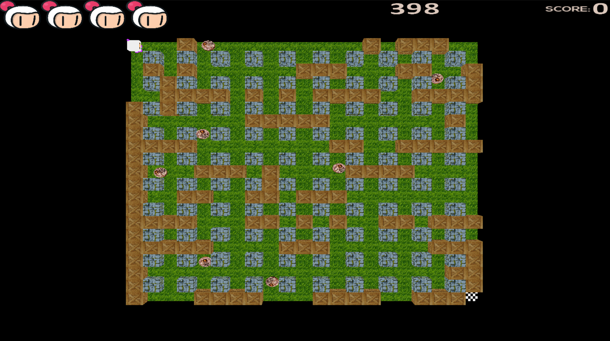
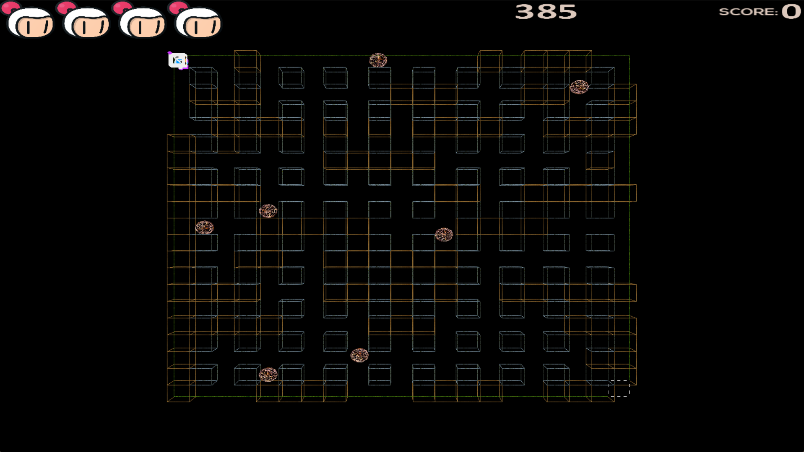
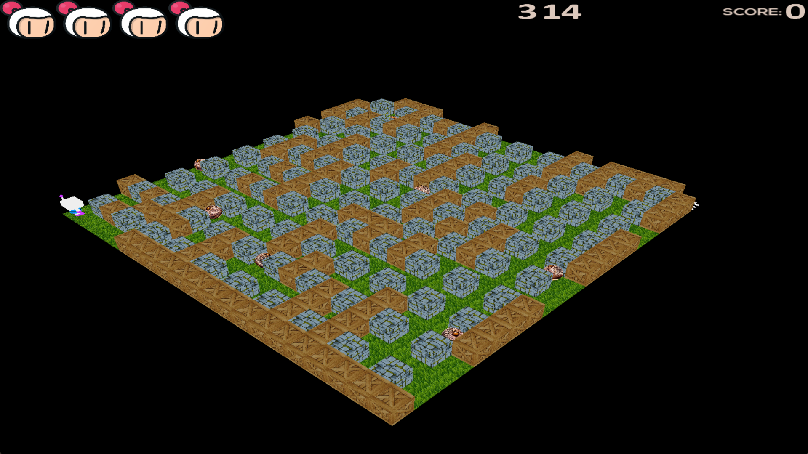

# 🧨 Bomberman 3D – OpenGL Project

This project is a Bomberman-inspired 3D game developed in C++ using OpenGL, focused on applying core concepts of Computer Graphics in a real-time interactive environment. It was developed as part of a university course in collaboration with two teammates.

## 🎮 Features

- 3D Environment Rendering using OpenGL  
- Real-time Lighting (Phong model: ambient, diffuse, specular)  
- Camera System (interactive control and navigation)  
- Texture Mapping  
- 3D Transformations (Model, View, Projection)  
- GLSL Shaders (vertex and fragment)  
- User Input Handling  
- Basic Game Mechanics:
  - Grid-based movement  
  - Bomb placement  
  - Explosion behavior  
  - Collision handling  

## 🧠 Learning Objectives

This project was developed as part of a Computer Graphics course, aiming to understand and implement:

- The OpenGL rendering pipeline  
- Shader programming with GLSL  
- Lighting models  
- Camera and coordinate systems  
- Real-time interaction in 3D environments  

## 🛠️ Technologies Used

- C++  
- OpenGL  
- GLSL  

## 📸 Screenshots

## 🚀 How to run

1. Clone the repository
2. Open in Microsoft Visual Studio
3. Click on the green arrow (Start)

